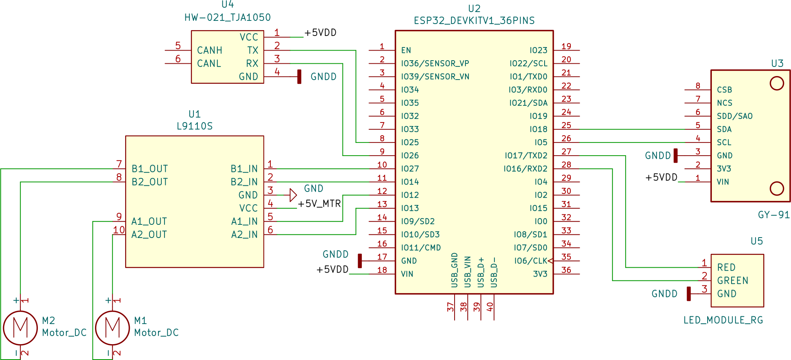

# Motion: Wheeled Platform

Zakhar moving platform equipped with an LED indication and an MPU module (GY-91).

The unit consists of:

- **ESP32 DevKit V1** - 36 pins
- **GY-91** - MPU module
- **HW-021 TJA1050** - CAN-bus driver
- Red-Green LED module

## Schematic

## Communication

**Bluetooth Serial**

- Device Name: **Zakhar: Wheels**
- PIN: **1234**

**CAN bus**

- Protocol: **qCAN 0.2.0**, standard CAN frame
- Address: **0x2**

**Serial**

- Speed: **115200** BPS

## Commands

Each command should consists of a single byte (DATA0 of the CAN frame) and an optional argument (DATA1).

|Action         |Command Code|Argument 0    |
|---------------|------------|--------------|
|               |[CAN DATA0] |[CAN DATA1]   |
|FORWARD        |0x77        |              |
|BACKWARD       |0x73        |              |
|LEFT           |0x61        |Angle: 0x0..FF|
|RIGHT          |0x64        |Angle: 0x0..FF|
|SHIVER         |0x71        |              |
|STOP           |0x20, 0xA0  |              |
|SPEED0         |0x30        |              |
|SPEED1         |0x31        |              |
|SPEED2         |0x32        |              |
|SPEED3         |0x33        |              |
|MPU_CALIBRATE  |0x63        |              |
|SET_ARG_TO_30  |0x23        |              |
|TEST           |0x74        |              |

Commands can be sent through the Serial interface using keyboard keys

|Action         |Keyboard Key    |
|---------------|----------------|
|FORWARD        |**w**           |
|BACKWARD       |**s**           |
|LEFT           |**a**           |
|RIGHT          |**d**           |
|SHIVER         |**q**           |
|STOP           |**Space**       |
|SPEED0         |**0**           |
|SPEED1         |**1**           |
|SPEED2         |**2**           |
|SPEED3         |**3**           |
|MPU_CALIBRATE  |**c**           |
|SET_ARG_TO_30  |**#**           |
|TEST           |**t**           |
