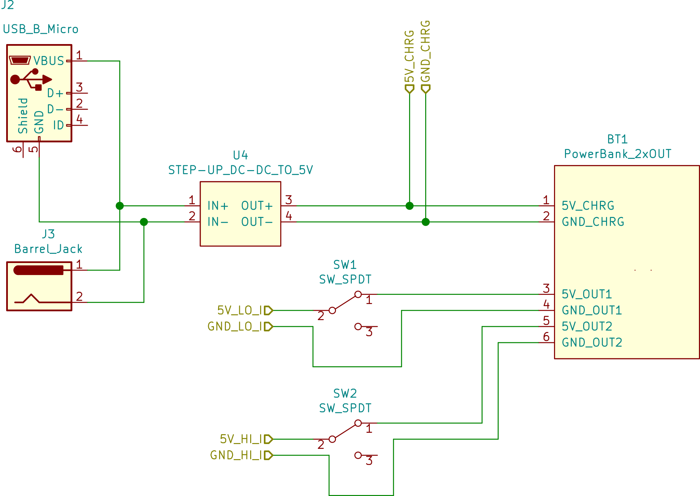
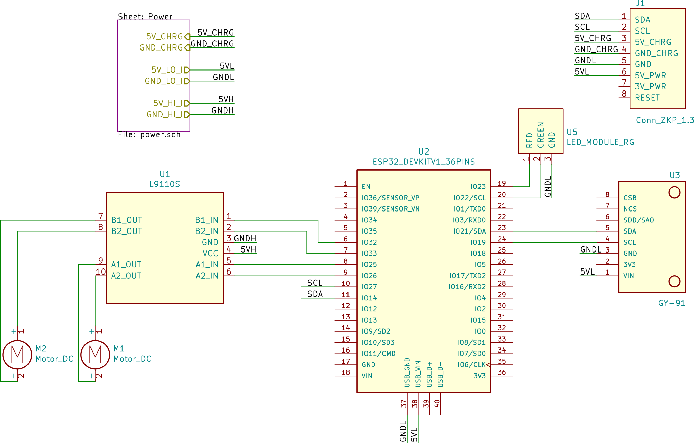

Moving platform for Zakhar. Equipped by led indication and an MPU module (GY-91).

## Schematic

Power:

Platform:

## Startup Sequence

1. Blink by red and green leds
2. Red led
3. Motors test: forward, left, right
4. Software initialization
5. If no error detected - green led
